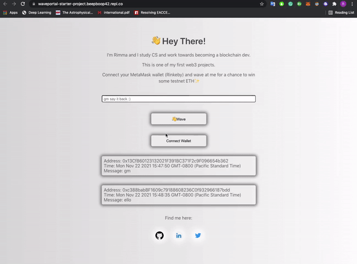

# About Wave Portal 👋 
Simple web3 app built with Solidity + Ethereum Smart Contracts.

Connect your MetaMask wallet (Rinkeby testnet) and send a wave w/ a message for a chance to win some testnet ETH.

# Prerequisites
- [MetaMask](https://metamask.io/) wallet
- love for saying 'gm' :)

# Demo

 

# Acknowledgments and Resources

This dApp is based on one of the amazing [buildspace](https://buildspace.so/) ~~cources~~ projects, check them out!
